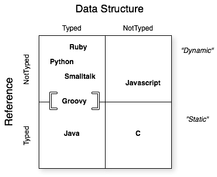

:icons: font
:source-highlighter: coderay

# Elementos esenciales de Groovy

## Sintaxis y azúcar sintáctica

### Comentarios
Es posible crear scripts ejecutables portables a plataformas Linux o Unix

[source, groovy]
----
#!/usr/bin/env groovy

// Denota comentarios de una sola línea
/*
  Comentarios multilínea
*/
/**
* Comentarios para Javadoc son tratados de la misma forma
* que los comentarios multilínea, pero son soportados por Groovydoc
*/
----

### Imports automáticos

[source,groovy]
----
// Groovy importa de manera ímplicita 6 paquetes y 2 clases
import java.lang.*
import java.util.*
import java.net.*
import java.io.*
import java.math.BigInteger
import java.math.BigDecimal
import groovy.lang.*
import groovy.util.*
----

### Paréntesis

[source,groovy]
----
// El uso de paréntesis es opcional cuando el método invocado tiene por lo menos un argumento
println("Hola mundo")
println "hola mundo"
// "MakingDevs".toUpperCase // NO es válido
"MakingDevs".toUpperCase()
----

### ‘return’ opcional

[source, groovy]
----
class Calculadora{
  def operacionCompleja(){
    4*5**6/89+13
  }
}
def c = new Calculadora()
c.operacionCompleja()
----

### Manejo de excepciones

[source, java]
----
// Java
try {
  Thread.sleep(5000);
} catch(InterruptedException ex) {

}
----

[source,groovy]
----
// Groovy
Thread.sleep 5000
----

### Sobrecarga de operadores
*Sobrecarga* se refiere al concepto orientado a objetos de tener tipos que especifican un comportamiento y subtipos que sobreescriben este comportamiento para hacerlo más específico. Cuando un lenguaje basa los operadores en llamadas a métodos y permite que dichos métodos sean sobrescritos, dicha aproximación se llama sobrecarga.

.Operadores basados en métodos
|===
|Operador | Nombre          | Método
|a + b    | Suma            | a.plus(b)
|a - b    | Resta           | a.minus(b)
|a * b    | Multiplicación  | a.multiply(b)
|a / b    | División        | a.div(b)
|a % b    | Módulo          | a.mod(b)
|a\++ ++a | Post incremento
            Pre incremento  | def v = a; a=next(); v
                              a = a.next(); a
|a-- --a  | Post decremento
            Pre decremento  | def v = a; a=previous(); v
                              a = a.previous(); a
|a == b   | Igual           | if (a implements Comparable) { a.compareTo(b) == 0 } else { a.equals(b) }
|a != b   | No igual        | ! a== b
|a > b    | Mayor que       | a.compareTo(b)
|a >= b   | Mayor igual que | a.compareTo(b)
|a < b    | Menor que       | a.compareTo(b)
|a \<= b  | Menor igual que | a.compareTo(b)
|===

TIP:  La lista completa! La encuentras en la link:http://groovy.codehaus.org/Operator+Overloading[documentación de Groovy]

*SumCash.groovy*

[source,groovy]
----
class Money{
  int amount
  String currency

  Money plus(Money other){
    if(null == other) return this
    if(other.currency != currency){
      throw new IllegalArgumentException("Invalid operation[$other.currency + $currency]")
    }
    return new Money(amount:amount + other.amount, currency:currency)
  }

  String toString(){
    "\$ $amount $currency"
  }
}
----

*Sobrecarga de operadores*

[source,groovy]
----
Money cuenta1 = new Money(amount:10,currency:'MXN')
Money cuenta2 = new Money(amount:20,currency:'MXN')
println cuenta1 + cuenta2
----

#### Operador de navegación segura, referencias seguras

Cuando una referencia no apunta a ningún objeto en específico, su valor es null. Cuando llamamos un método o accesamos a un atributo de una referencia nula un NullPointerException nos revienta en la cara.

*Null safe*

[source,groovy]
----
def s = null
s.reverse() // NPE
s?.reverse() // null
s?.reverse()?.charAt(0)
----

*Aserciones*
Es una manera de evaluar una expresión o la ejecución de una instrucción y se refiere a la palabra reservada ’‘’assert’ que siempre evalua a true.

[source,groovy]
----
assert(true)
assert 1 == 1
def x = 1; assert x == 1
def y = 2; assert y == 2
assert ('text'*3<<'hello').size() == 4*3+5
----

#### Groovy truth
Es una abreviatura para evaluar cuando algo es verdadero. En Java solo se evalua el tipo boolean, sin embargo, en Groovy podemos evaluar si es null o si el tamaño es cero, o bien, esta vacío…

.Secuencia de reglas usadas para evaluar una prueba booleana
|===
| Tipo en runtime   | Criterio de evaluación para ser cierto(true)
| Boolean           | Corresponde al valor booleano 'true'
| Matcher           | The matcher tiene un coincidencia
| Collection        | La colección no es vacía
| Map               | El mapa no está vacío
| String, GString   | El String no es vacío
| Number, Character | El valor no es cero
| Cualquier otro    | El objeto referenciado no es null
|===

*Ejemplos*

[source,groovy]
----
assert true
assert !false
assert "a"
assert !""
assert 1.1
assert 1
assert !0
assert -1.2
assert ! null
assert ![]
assert ![:]
----

#### Primitivos como objetos
"Todo en Groovy es un objeto, incluso lo que declaras como primitivos."

[source,groovy]
----
int a = 1
double b = 2.0
float c = 3.0
char d = 'a'
boolean e = true

println a.class
println b.class
println c.class
println d.class
println e.class // meh!
----

#### Strings

*theStrings.groovy*

[source,groovy]
----
println "he said 'cheese' once"
println 'he said "cheese!" again'

//Concatenacion
a = "world"
print "hello " + a + "\n"

//Uso de Strings con triples comillas
def name = "MakingDevs"
def text = """\
Hola $name
como estas?
"""

assert text != null
println(text)

//Uso de GStrings
println new Date()
x = "Actualmente es ${ new Date() }"
assert x.values[0] instanceof Date
println x

def s = "String "
def g = "GString creado a las ${new Date()}"
def x = s + g
assert s instanceof String
assert g instanceof GString
assert x instanceof String
----

TIP: Adicionalmente! Siempre es de ayuda tener la link:http://groovy.codehaus.org/JN1525-Strings[documentación de String en Groovy]

#### Más operadores(==, <=>, ?:)

*Equals ==*

[source,groovy]
----
assert new BigDecimal(90) == 90
assert "MakingDevs" == "MakingDevs"

class Telefono{
  String tipo
  boolean equals(Telefono otroTelefono){
    println "Comparando"
    tipo == otroTelefono.tipo
  }
}
def t1 = new Telefono()
t1.tipo = 'Smartphone'
def t2 = new Telefono()
t2.tipo = 'Cellphone'
assert t1 != t2
----

A diferencia de Java, el operador == ejecuta el método equals o compareTo si Comparable está implementado

*Spacheship <=>*

[source,groovy]
----
assert 5 <=> 5 == 0
assert 10 <=> 5 == 1
assert 10 <=> 20 == -1
assert "MakingDevs" <=> "MakingDevs" == 0
assert "MakingDevs" <=> "MD" == 1
assert "MD" <=> "MakingDevs" == -1
----

Es una forma de ejecutar el método compareTo()

*Elvis ?:*

[source,groovy]
----
(x,y) = ['v','d']
if(x != null && x.size() > 0) x else y
if(x && x.size()) x else y // Groovy Truth
if(x) x else y // Groovy Truth
x ? x : y
x ?: y
----

Es una abreviatura al operador ternario de Java para manejo de dos valores

### Expresiones regulares
Groovy cuenta con operadores que aportan mucha flexibilidad y facilidad de uso a las expresiones regulares:

* El operador de expresiones regulares find =~
* El operador de expresiones regulares match ==~
* El operador de expresiones regulares pattern ~String

*String regex*

[source,groovy]
----
assert 'abcde'.find{ it > 'b' } == 'c'
assert 'abcde'.findAll{ it > 'b' } == ['c', 'd', 'e']
assert 'abcde'.findIndexOf{ it > 'c' } == 3
assert 'abcde'.every{ it < 'g' } && ! 'abcde'.every{ it < 'c' }
assert 'abcde'.any{ it > 'c' } && ! 'abcde'.any{ it > 'g' }
assert 'MakingDevs'.replace('e','3') == 'MakingD3vs'
assert 'AbcdE'.equalsIgnoreCase('aBCDe')

def s= new String( new StringBuffer('abcdefg') )
assert s == 'abcdefg'
assert s.contains('def')
assert s.contentEquals('abcdefg')
assert s.contentEquals( new StringBuffer('abcdefg') )
def s2= s.replace('def', 'xyz')
assert s2 == 'abcxyzg'
----

*find y match*

[source,groovy]
----
def finder = ('groovy' =~ /gr.*/)
assert finder instanceof java.util.regex.Matcher

def matcher = ('groovy' ==~ /gr.*/)
assert matcher instanceof Boolean

assert 'Groovy rocks!' =~ /Groovy/  // =~ en condicional es un boolean
assert !('Groovy rocks!' ==~ /Groovy/)  // ==~ coincidencia exacta
assert 'Groovy rocks!' ==~ /Groovy.*/

def cool = /gr\w{4}/
def findCool = ('groovy, java and grails rocks!' =~ /$cool/)
assert 2 == findCool.count
assert 2 == findCool.size()
assert 'groovy' == findCool[0]
assert 'grails' == findCool.getAt(1)

def group = ('groovy and grails, ruby and rails' =~ /(\w+) and (\w+)/)
assert group.hasGroup()
assert 2 == group.size()
assert ['groovy and grails', 'groovy', 'grails'] == group[0]
assert 'rails' == group[1][2]

assert 'Hola MakingDevs' == ('Saludos MakingDevs' =~ /Saludos/).replaceFirst('Hola')
----

*Pattern ~String*

[source,groovy]
----
import java.util.regex.Pattern

def simplePattern = ~'[ab]test\\d'
assert Pattern == simplePattern.class

def quotedPattern = ~"string\$"
assert quotedPattern instanceof Pattern

def slashy = ~/slashy \d+ value/
assert slashy instanceof Pattern

// Patrón negado
def negateSlashy = /${'hello'}GString$/.negate()
assert negateSlashy instanceof Pattern
def s = 'more'
def curlySlashy = ~"$s GString"
assert curlySlashy instanceof Pattern

def testPattern = ~'t..t'
assert testPattern.matcher("test").matches()

// Sobrecarga de operadores
def p = ~/\w+vy/
assert p.isCase('groovy')
switch ('groovy') {
  case ~/java/: assert false; break;
  case ~/gr\w{4}/: assert true; break;
  default: assert false
}
----

TIP: Profundiza! Te recomendamos: link:http://groovy.codehaus.org/Regular+Expressions[Regular expressions]

### Compatibilidad con los elementos de Java
Es importante considerar que los elementos que existen actualmente en Java(incluyendo los agregados de Java 5), siguen funcionando y siendo respetados, sin embargo, Groovy agrega una forma más elegante de usarlos.

#### Enums
*issueEnum.groovy*

[source,groovy]
----
enum IssuePriority{
  URGENT,HIGH,MEDIUM,LOW,PLEASE,NO_MATTERS
}

def issueNotifier(priority){
  print "Notificando incidencia..."
  switch(priority){
    case[IssuePriority.URGENT,IssuePriority.HIGH]:
      println "Se cayó la App, ¿es viernes?..."
      break
    case IssuePriority.PLEASE..IssuePriority.MEDIUM:
      println "Podemos dejarlo para después?..."
      break
    case IssuePriority.NO_MATTERS:
      println "Luego lo hacemos..."
      break
  }
}

issueNotifier(IssuePriority.URGENT)
issueNotifier(IssuePriority.MEDIUM)
issueNotifier(IssuePriority.NO_MATTERS)

println "Hay que escalar una incidencia, los niveles son: "
for(priority in IssuePriority.values()){
  print "$priority "
}
----

#### Varargs

[source,groovy]
----
def varargsJava(int a, int... b){
  println "Pasaste $a y $b"
}

def metodoConArray(int a, int[] b){
  println "Pasaste $a y $b"
}

varargsJava(1,2,3,4,5)
metodoConArray(1,2,3,4,5)
----

#### Genéricos

[source,groovy]
----
class Genericos{
  def usaLista(){
    ArrayList<Integer> list = new ArrayList<Integer>();
    list.add(1);
    list.add(2.0); // ????
    list.add("hello"); // ???
    list
  }
}
def g = new Genericos()
g.usaLista()
// Necesitamos compilación estática...
----

#### Static imports

[source,groovy]
----
import static java.lang.Math.*
import static Math.random as rand
import groovy.lang.ExpandoMetaClass as EMC

println cos(PI/2)
double value = rand()
def metaClass = new EMC(Integer)
assert metaClass.getClass().name == 'groovy.lang.ExpandoMetaClass'
----

#### Anotaciones

Todas las anotaciones conocidas en Java y las que usas en algún Framework son respetadas y no sufren ninguna modificación.

[source,groovy]
----
import static org.junit.Assert.assertEquals
class SimpleUnitTest {
  @Test
  void shouldAdd() {
    assertEquals("Groovy should add correctly", 2, 1 + 1)
  }
}
----

#### Tipado dinámico

TIP: Until real software engineering is developed, the next best practice is to develop with a dynamic system that has extreme late binding in all aspects.
~ Alan Kay

En el tipado dinámico, en runtime los tipos son inferidos y los métodos y sus argumentos son checados. Con esta habilidad podemos inyectar comportamiento en las clases en tiempo de ejecución, haciendo el código más extensible que con el tipado estático estricto.

Venimos confiando en la “seguridad” del chequeo de tipos en tiempo de compilación. Sin embargo, seguridad en la seguridad de tipos es tan consolador como la seguridad en la seguridad social.

En el tipado dinámico dejamos que el lenguaje infiera los tipos basados en el contexto. ¿Cuál es la ventaja? ¿Vale la pena renunciar a los beneficios de la verificación del tipo en el tiempo de compilación o edición de código(IDE)?

Podemos escribit llamadas a métodos sobre objetos sin profundizar en los detalles en el momento. Durante la ejecución los objetos responden dinámicamente a los métodos o los mensajes. Podemos lograr este comportamiento dinámico en cierta medida con el polimorfismo en lenguajes de tipado estático. Sin embargo, la mayoría de los lenguajes de tipado estático usan herencia para el polimorfismo. El verdadero polimorfismo no se preocupa de los tipos, manda un mensaje a un objeto, y en tiempo de ejecución se da cuenta de la implementación apropiada que tiene que usar.

*tipadoDinamico.groovy*

[source,groovy]
----
import org.codehaus.groovy.runtime.typehandling.GroovyCastException as GCE

def variableDinamica
variableDinamica = 1 ; assert variableDinamica.class == Integer
variableDinamica = 2f ; assert variableDinamica.class == Float
variableDinamica = 3d ; assert variableDinamica.class == Double
variableDinamica = 3g ; assert variableDinamica.class == BigInteger
variableDinamica = 'a' ; assert variableDinamica.class == String
variableDinamica = true ; assert variableDinamica.class == Boolean

BigDecimal variableTipada = 3
assert variableTipada.class == BigDecimal.class
variableTipada = "A"
assert variableTipada.class == BigDecimal.class
try {
  variableTipada = "Hola"
} catch(GCE e){
  println e.message
}
----

Si investigamos acerca de los lenguajes dinámicos encontraremos que implica un tipado débil de manera rotunda. La verdad es más compleja. Por ejemplo, a pesar de ser un lenguaje dinámico, Groovy es un lenguaje fuertemente tipado. Y lo era incluso antes de la liberación de Groovy 2 y la comprobación de tipos estáticos. De hecho, Groovy es un lenguaje dinámico de tipado opcional. La diferencia es que los tipos en Groovy son muy importantes y están en el corazón del sistema de distribución dinámica.

TIP: Si camina como pato y grazna como pato entonces es un pato. Sin embargo, si camina como pato y necesita baterias entonces tenemos la abstracción incorrecta.
~ duckTyping.groovy

[small]#Powered by link:http://makingdevs.com/[MakingDevs.com]#
