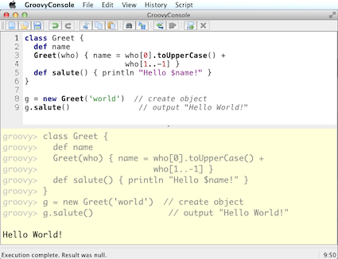

:icons: font
:source-highlighter: coderay

# Fundamentos y principios de Groovy

  Eres un desarrollador Java...
  Groovy es Java y Java es Groovy...
  Eres un desarrollador Groovy!

## Ejecutando código Groovy
* Instalación convencional
* Tener el JDK instalado
* Establecer la variable JAVA_HOME y agregarla al PATH en el subdirectorio /bin
* Descargamos la distribución de Groovy en http://groovy.codehaus.org/
* Creamos una variable de entorno GROOVY_HOME apuntando al directorio donde se descomprimió la distribución
* Adicionalmente, incluir en el PATH el directorio /bin de la variable de entorno GROOVY_HOME, es decir: %GROOVY_HOME%/bin
* Let’s rock the code!!!

TIP: Acerca de la instalación: El binario de la distribución soporta múltiples plataformas, algunas distribuciones Linux ya lo contemplan en sus repositorios

## Instalación recomendada para *nix
GVM es una herramienta para administrar versiones paralelas de múltiples kits de desarrollos sobre la mayoría de sistemas Unix. Provee de una interfaz conveniente en línea de comando para instalar, cambiar, quitar y listar los kits candidatos.

GVM estuvo inspirado en RVM usado por la comunidad de Ruby.

Los kits que están actualmente soportados son:
* Groovy
* Grails
* Griffon
* Gradle
* Groovyserv
* Lazybones
* vert.x

Corre sobre las siguientes plataformas:
* Linux
* Mac OSX
* Cygwin
* Solaris
* FreeBSD (with bash installed)

GVM está escrito en bash y solamente necesitar tener instalado en el sistema operativo curl y unzip. El instalador checa por dichas dependencias antes de completar el proceso de instalación. Después, crea el directorio .gvm/ en el ‘home’ del usuario, para despúes descargar y configurar los kits que deseas.

Para instalar GVM y la última versión de Groovy solo tenemos que abrir una terminal de bash y teclear:

----
curl -s get.gvmtool.net | bash
gvm install groovy
----

## Groovy Shell => groovysh
Sólo abre una consola y escribe ‘groovysh’, comienza a codificar:

----
❯ groovysh
Groovy Shell (2.1.7, JVM: 1.7.0_06-ea)
Type 'help' or '\h' for help.
--------------------------------------
groovy:000> println "Hola MakingDevs!"
Hola MakingDevs!
===> null
groovy:000>
----

### Ejecución desde línea de comando
Crea un archivo de texto con la extensión .groovy y desde línea de comando ejecutalo:

----
❯ groovy archivo.groovy
----

Realmente lo que sucede es que Groovy compila y ejecuta el contenido del archivo pero no nos entrega el bytecode; si deseamos obtenerlo entonces tenemos que decirle que lo genere:

----
❯ groovyc archivo.groovy
----

TIP: Bytecode! ¿Qué podemos hacer con bytecode?

Uso de la GroovyConsole
Para ejecutarlo en la consola escribimos: groovyConsole

### De Java a Groovy

HolaMundo en Java

[source,java]
----
public class HolaMundo {
  private String nombre;
  public String getNombre() {
    return nombre;
  }
  public void setNombre(String nombre) {
    this.nombre = nombre;
  }
  public String saluda() {
    return "Hola " + this.nombre + " !!!";
  }
  public static void main(String[] args) {
    HolaMundo objeto = new HolaMundo();
    objeto.setNombre("@grailsmx");
    System.out.println(objeto.saluda());
  }
}
----

HolaMundo en Groovy

[source,groovy]
----
public class HolaMundo {
  private String nombre;
  public String getNombre() {
    return nombre;
  }
  public void setNombre(String nombre) {
    this.nombre = nombre;
  }
  public String saluda() {
    return "Hola " + this.nombre + " !!!";
  }
  public static void main(String[] args) {
    HolaMundo objeto = new HolaMundo();
    objeto.setNombre("@grailsmx");
    System.out.println(objeto.saluda());
  }
}
----

### 7 pasos => De Java a Groovy
*Paso1: Quitamos lo que es 'obvio'*

Toda clase, método, campo en Groovy tiene acceso público a menos que se especifique lo contrario
‘;’ es opcional al final de la línea en la mayoría de los casos

*Paso 2: La ceremonia de Java*

* Estático vs. Dinámico == Ceremonia vs. Esencia
* Según la convención de JavaBean, cada propiedad requiere de un par de métodos (get/set)
* El método main() siempre requiere de Strings[] como parámetro
* Imprimir a consola es muy común, acaso existe alguna %&/(&/$·%) manera más corta???

*Paso 3: Los tipos dinámicos*

* La palabra reservada def se usa cuando no es necesario indicar el tipo específico de una variable, método o campo( es como var de Javascript)
* Groovy averiguará el tipo correcto en tiempo de ejecución, esto habilita entre otras cosas lo que se conoce como duck typing

*Paso 4: Interpolación de variables*

* Groovy permite la interpolación de variables a través de GStrings (como Perl)
* Basta con precederla de $ o rodearla de ${} para usarlo

*Paso 5: Otras palabras reservadas*

* La palabra ‘return’ es opcional en muchos casos, el valor de retorno será el valor de la última expresión evaluada en el contexto
* La palabra def no es necesaria cuando se trata de métodos estáticos

*Paso 6: Plain Old Groovy Objects(POGO)*

* Los POJO’s (o POGO’s en Groovy) tienen un constructor por omisión que acepta un Map, dando la impresión de usar parámetros con nombres
* Los POGO’s soportan la notación de arreglo (bean[prop]) o la notación de objeto (bean.prop) para acceder a sus propiedades (lectura/escritura)

*Paso 7: Lenguajes de scripting*

* A pesar de Groovy compila a código byte, soporta programas tipo Script, los cuales también se compilan a código byte
* Todo Script permite definir clases en cualquier parte
* Todo Script soporta la definición de paquetes (package) puesto que al fin y al cabo son clases Java

#### Nuevo Hola Mundo en Groovy

[source, groovy]
----
class HolaMundo {
  String nombre
  def saluda() { "Hola  ${this.nombre} !!!" }
}

def objeto = new HolaMundo(nombre:"@grailsmx")
println(objeto.saluda())
----

[NOTE]
.Ejecución de Groovy con Java
====
Unix - Linux
----
groovyc HolaMundo.groovy
java -cp $GROOVY_HOME/embeddable/groovy-all-2.1.7.jar:. HolaMundo
----

Windows
----
groovyc HolaMundo.groovy
java -cp %GROOVY_HOME%/embeddable/groovy-all-2.1.7.jar;. HolaMundo
----
====

### Scripts y clases en Groovy

#### Declaración de clases
* Podemos declarar de la misma forma que una clase Java
* Hay flexibilidad en el nombre del archivo
* Podemos declarar más de una clase en un solo script

*Persona.groovy*

[source,groovy]
----
public class Persona {

  private String nombre
  public Date edad
  protected Double peso

  public Persona(){}

  public Persona(Date edad){ this.edad = edad; }

  public setNombre(String nombre){ this.nombre = nombre; }

}
----

*MultiplesClases.groovy*

[source, groovy]
----
class Perfil {
  private String bio
  private Persona persona
  private String twitter
  private String facebook
}

class Pedido {
  Persona persona
  Date dateCreated
  Date lastUpdated
  String toString() {
    "$persona - $dateCreated"
  }
}
----
